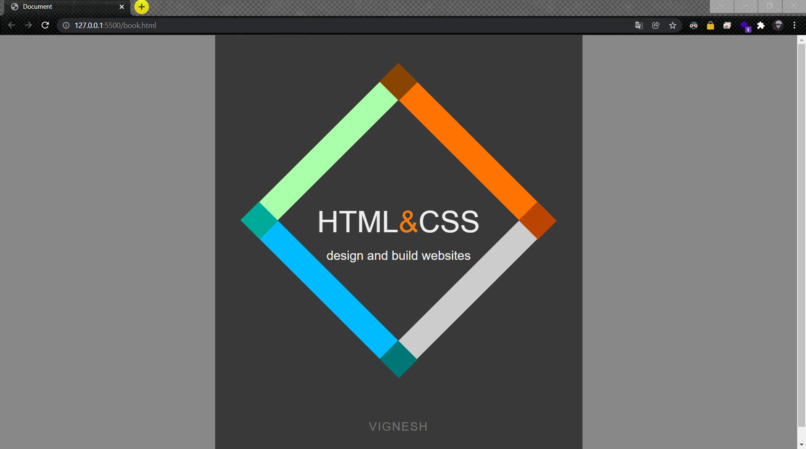

# Book-cover

## AIM
Design a book cover page using html and css

# ALGORITHM
### STEP 1
create a simple html page using heading tag
### STEP 2
Create a div to create a book layout
### STEP 3
Use css to create a color and design to a book
### STEP 4
Execute the program

# CODE
book.html
~~~
<!DOCTYPE html>
<html lang="en">
<head>
    <meta charset="UTF-8">
    <meta http-equiv="X-UA-Compatible" content="IE=edge">
    <meta name="viewport" content="width=device-width, initial-scale=1.0">
    <title>Document</title>
    <link rel="stylesheet" href="book.css"
</head>
<body>

    

        

            

            

            

            

        

        
HTML&CSS

        
design and build websites

    

    
Vignesh

</body>
</html>
~~~
book.css
~~~
body {background: #888; height: 100%;}
span {color: #F57D11;}

.book {
    display: block;
    position: absolute;
    height: 850px;
    width: 700px;
    overflow: hidden;
    top: 50%;
    left: 50%;
    -webkit-transform: translate(-50%,-50%);
    -ms-transform: translate(-50%,-50%);
    transform: translate(-50%,-50%);
    background: #393939;
}
.cover-design {
    display: block;
    position: absolute;
    height: 600px;
    width: 600px;
    top: 45%;
    left: 50%;
    -webkit-transform: translate(-50%,-50%);
    -ms-transform: translate(-50%,-50%);
    transform: translate(-50%,-50%);
    font-family: sans-serif;
    color: #EEE;
}
.diamond-frame {
    position: absolute;
    height: 325px;
    width: 325px;
    top: 64.8%;
    left: 14.5%;
    -webkit-transform: rotate(45deg) translate(-50%,-50%);
    -ms-transform: rotate(45deg) translate(-50%,-50%);
    transform: rotate(45deg) translate(-50%,-50%);
    border-left: 50px solid #AFA;
    border-right: 50px solid #CCC;
    border-top: 50px solid #FF7300;
    border-bottom: 50px solid #0BF;
}
.box {
    position: absolute;
    height: 50px;
    width: 52px;
    z-index: 1000;
}
.a {background: #840; top: -50px; left: -51px;}
.b {background: #b40; top: -50px; right: -51px;}
.c {background: #077; bottom: -50px; right: -51px;}
.d {background: #0A9; bottom: -50px; left: -51px;}

.book-title {
    position: absolute;
    width: 100%;
    font-size: 57px;
    top: 45%;
    text-align: center;
}
.book-subtitle {
    position: absolute;
    width: 100%;
    font-size: 24px;
    top: 55%;
    text-align: center;
}
.book-author {
    display: block;
    position: absolute;
    width: 100%;
    top: 90%;
    text-transform: uppercase;
    color: #777;
    font-size: 22px;
    font-family: sans-serif;
    letter-spacing: 2px;
    text-align: center;
}
~~~
# OUPUT

# RESULT
book cover page using html and css was successfully executed.